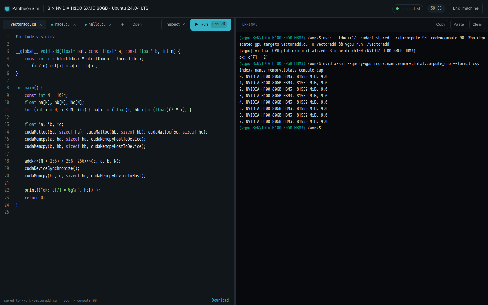

# PantheonSim

**Run CUDA and HIP programs, unmodified, on a CPU. No GPU needed.**

PantheonSim simulates NVIDIA and AMD GPUs (a T4, an H100, a B200, an MI300X) on
an ordinary CPU. Programs built with the real `nvcc` or `hipcc` run against it
unchanged, and `nvidia-smi`, `rocm-smi` and the vendor libraries report the GPUs
you asked for. Learn GPU programming without a GPU, and test GPU code in CI on
standard runners.

[](https://pantheonsim.com/play/)

- **Try it in your browser.** [pantheonsim.com/play](https://pantheonsim.com/play/)
  gives you a Linux machine with simulated GPUs, an editor, a terminal, and `nvcc`
  or `hipcc`. No sign-up.
- **Test GPU code in GitHub Actions.** One step, on the standard runners:

  ```yaml
  - uses: pantheongpu/setup-pantheonsim@v0
    with:
      gpu: nvidia/h100        # or amd/mi300x
  - run: cmake -S . -B build && cmake --build build && ctest --test-dir build
  ```

  More at [pantheonsim.com/ci](https://pantheonsim.com/ci/).
- **Run it on your own machine.** [Build it](#build--test) (C++20, no
  dependencies), then `vgpu run ./your_program`.
  Or [pull it as a container image](docs/docker.md).

PantheonSim checks what your code does, not how fast it runs: there is no
performance model, and a run on physical GPUs before a release is still the
final word. The intended CI model is simulated GPUs on every commit, physical
ones nightly or before a release. The simulator engine and its CLI are called
VirtualGPU (`vgpu`).

## Status

The engine is vendor-neutral; NVIDIA and CUDA support lives in [`nvidia/`](nvidia/README.md) and
AMD and ROCm in [`amd/`](amd/README.md). [ARCHITECTURE.md](ARCHITECTURE.md) has the map.

Working today, all CPU-only:

| Area | State |
| --- | --- |
| Device profiles | Twelve NVIDIA profiles verified against physical cards across six architectures — Turing, Ampere sm_80/sm_86, Ada, Hopper, Grace-Hopper — each matching its device on 512 conformance values. `h200` and `b200` are not yet characterized. Fifteen more NVIDIA profiles (H200, B200, B300, GB200, Rubin, Jetson Thor, RTX 5090, RTX PRO 6000, GB10 in the DGX Spark, RTX 4090, L40, RTX 3090, A40, A30, RTX 2080 Ti) are built from public documents only and marked `verified: false`: nothing in them was measured, and Rubin and Thor carry placeholder PCI ids because NVIDIA has published none. [nvidia/docs/profiles.md](nvidia/docs/profiles.md) lists them. AMD: MI325X is read from a physical card; MI300X and MI350X are placeholders. Each profile's header says where its values came from |
| `vgpu` CLI | `list-gpus`, `info --gpu <id> [--json]`, `demo vectoradd` |
| Virtual VRAM | sparse/lazy backing — a virtual H200 claims 141 GB on a 16 GB host, and past `VGPU_MEMORY_RAM_MB` it spills to disk; OOB / use-after-free / double-free / misalignment diagnostics |
| PTX | lexer/parser for a growing subset (see ARCHITECTURE.md); precise `unsupported` errors for the rest |
| Execution | SIMT warp interpreter: 32-lane warps, divergence masks, shared memory, `bar.sync`, warp shuffles/vote, atomics, tensor-core `wmma`, f16/f16x2, deterministic scheduling |
| Driver API | `libvgpucuda.so` + clean-room `vgpu_cuda.h`: init/discovery/context/memory/module/`cuLaunchKernel`, `cuLibrary`/`cuKernel`, `cuGetProcAddress` |
| Runtime API | `libvgpucudart` (drop-in `libcudart.so.13`): the CUDA **Runtime** API + nvcc host-registration ABI, so unmodified nvcc apps run unchanged |
| Fatbin | extracts embedded PTX from nvcc fatbins (uncompressed, zstd and LZ4 — so binaries from CUDA 12 and 13 both work) |
| Virtual memory | the `cuMem*` mapping API: address space reserved without memory, physical handles with no address, mappings that are unusable until access is granted — so a buffer grows in place, which is what PyTorch's expandable segments and NCCL's windows need. Reserved-but-unmapped, no-access and read-only faults each say which they were |
| Multi-GPU | a virtual rack of N devices with disjoint address windows; peer copies and per-device isolation match a real two-GPU machine; `CUDA_VISIBLE_DEVICES` and `CUDA_DEVICE_ORDER` read as the driver reads them, and every device attribute and `cudaDeviceProp` member (L2, bus width, texture limits, PCI identity, UUID matching NVML's) answers from one table checked against an RTX 3060 — see [nvidia/docs/devices.md](nvidia/docs/devices.md) |
| Vendor libraries | cuBLAS, cuBLASLt, cuDNN, cuFFT, cuRAND, cuSPARSE, cuSPARSELt, cuSOLVER, cuTENSOR, cuTensorNet, NCCL, NVRTC, NPP and nvJPEG under their real sonames, each differential-tested against NVIDIA's own library on a physical GPU; also cuStateVec, cuDSS, nvJitLink, nvFatbin, cuFile (GPUDirect Storage's compatibility mode), nvCOMP (its standard formats and GDeflate, interoperable with NVIDIA's) and NVSHMEM (one simulated GPU per PE process, NVIDIA's device API on the simulator's host library) — see [nvidia/docs/libraries.md](nvidia/docs/libraries.md) |
| PyTorch | PyTorch's official CUDA 13 build runs unmodified on the simulated NVIDIA GPUs, T4 to B200 and RTX 5090: GPT, ResNet, LSTM, U-Net, ViT, MoE and DLRM training all match the CPU — see [nvidia/docs/pytorch.md](nvidia/docs/pytorch.md). PyTorch for ROCm runs on the simulated AMD GPUs — see [amd/README.md](amd/README.md) |
| Python JIT | Numba runs unmodified (its PTX is assembled through the driver's JIT link API); Triton runs unmodified under `vgpu run` and `vgpu shell` (`vgpu-ptxas` stands in for `ptxas`) — see [nvidia/docs/jit.md](nvidia/docs/jit.md) |
| Discovery | live telemetry + NVML; drop-in `nvidia-smi`, `rocm-smi`, `amd-smi`, `rocm_agent_enumerator`, and `lspci` output — see [docs/telemetry.md](docs/telemetry.md) |
| Registers | PCI configuration space from a register database: header, PM, MSI, PCI Express and AER, live link and error state, BAR sizing; `vgpu regs list/read/write/dump/log` with an access log; AMD MMIO (engine status, the SMU mailbox) from the amdgpu headers; a C API, `vgpu_regs.h` — see [docs/registers.md](docs/registers.md) |
| AMD | unmodified hipcc-built programs, from ROCm 6.4, 7.0, 7.1 or 7.2, run on a simulated MI300X: the HIP runtime ABI, CDNA3 (gfx942) code checked instruction by instruction against ROCm's llvm-objdump and executed on every host core, device-side `printf`, and every pantheon workload with `--verify`. AMD's `rocprofv3` runs unmodified, with the counters the interpreter counts exactly. So does rocBLAS: AMD's own quick tests pass (162,807 float and double ones, and the half, bfloat16, int8 and FP8 GEMMs run) — see [amd/README.md](amd/README.md) |
| Profiling | CUPTI under its real soname: the Activity API (kernels, copies, fills, waits, streams, devices, runtime API calls, memory and pool records, graph traces, events and overhead, correlated) and the Callback API (every runtime function, resource including modules and graphs, and synchronize domains); `torch.profiler` collects a GPU trace, checked against the trace NVIDIA's CUPTI prints on an RTX 3060; unmodified nvprof traces a program on the T4 profile. `vgpu ncu` is this project's own `ncu`; Nsight Systems and Nsight Compute as NVIDIA ships them are not supported (`nsys` collects no CUDA data). See [nvidia/docs/cupti.md](nvidia/docs/cupti.md) |
| NVENC / NVDEC | `libnvidia-encode.so.1` answering the API as an RTX 3060 does, with lossless PCM H.264 and HEVC streams that ffmpeg decodes (and, being deterministic, video-encode SDC tests run), and `libnvcuvid.so.1` decoding Motion JPEG into the card's NV12 surfaces — see [nvidia/docs/libraries.md](nvidia/docs/libraries.md) |
| Proof | an nvcc-compiled CUDA program **and** the unmodified pantheon stress kernels run on the CPU; `memory_read` differential-matches a physical RTX 3060 (incl. fault injection + device printf) |

Known limitations (deliberate, documented):

- Kernels run from **SASS** when the binary carries it (the default engine on
  every generation from sm_75 to sm_120a, see [nvidia/docs/sass.md](nvidia/docs/sass.md))
  and from **PTX** otherwise (embedded, or in a fatbin; zstd fatbins are
  decompressed). `VGPU_SASS=0` forces the PTX path.
- Unmodified apps must link **shared** cudart (`nvcc -cudart shared`) so the
  loader can substitute VirtualGPU's `libcudart.so.13`. The source is untouched;
  hosting a *statically* linked cudart needs NVIDIA's undocumented driver export
  tables and is future work. This is what stops CuPy, which links cudart
  statically — see [nvidia/docs/jit.md](nvidia/docs/jit.md).
- `wmma` fragment layout is VirtualGPU's own (PTX leaves it unspecified) —
  see ARCHITECTURE.md D8. bf16, `cp.async`, `mma.sync`, `ldmatrix`, the
  extended-precision carry family, textures, surfaces, grid sync, named
  barriers, Hopper's warpgroup MMA (`wgmma`), TMA (multicast, reductions and
  im2col included), thread-block cluster barriers and distributed shared
  memory are implemented -- checked against CuTe and CUTLASS's own Hopper
  unit tests, its convolutions among them. Every gap fails loudly
  (instruction, PTX line, kernel, profile), never silently.
- NVENC (video encode) is served by `libvgpunvenc`, presented as
  `libnvidia-encode.so.1`: the API as an RTX 3060 answers it, with H.264 and HEVC
  written as lossless PCM pictures any decoder reads (ffmpeg's is the test), so
  encoder stress and corruption checks run; it is not compression. NVDEC (`libvgpunvcuvid`, presented as
  `libnvcuvid.so.1`) decodes Motion JPEG and reports every other codec
  unsupported. OptiX (ray tracing) is a separate
  NVIDIA subsystem, not CUDA, and is out of scope.
- AMD runs gfx942 (MI300X, MI325X), gfx950 (MI350X), gfx90a (MI250X),
  gfx1030 (Radeon RX 6900 XT, RDNA2), gfx1100 (Radeon RX 7900 XTX, RDNA3) and
  gfx1201 (Radeon RX 9070 XT, RDNA4) code, through its own HIP and HSA runtimes; rocBLAS, hipBLASLt, MIOpen and
  PyTorch run on it — see [amd/README.md](amd/README.md).

## Build & test

Requirements: Linux, CMake ≥ 3.20, a C++20 compiler (gcc 13+ / clang 17+).
No GPU, no CUDA toolkit, no third-party libraries.

```
./scripts/build.sh
./scripts/test.sh
```

Then:

```
./build/vgpu list-gpus
./build/vgpu info --gpu nvidia/h200
./build/vgpu demo vectoradd --gpu nvidia/h100 -n 1000000
```

### Simulating a whole machine

```bash
build/bin/vgpu shell        # pick a GPU, CUDA/driver and OS, then get a shell
```

Inside it, `nvidia-smi`, `rocm-smi`, `amd-smi`, `rocm_agent_enumerator`, `lspci`, `dmesg`,
`uname` and `/proc/driver/nvidia/version` all reflect the machine you asked
for, and CUDA programs run on the CPU engine. See
[docs/machine-simulator.md](docs/machine-simulator.md).

### Running an unmodified CUDA application

```bash
# Build the app from unmodified source against shared cudart, then run it on a
# virtual GPU — no physical GPU involved.
nvcc -cudart shared my_app.cu -o my_app
build/vgpu run --gpu nvidia/h200 ./my_app
```

`vgpu run` puts the simulator's CUDA libraries in front of the real ones and
execs the program in place, so its exit code and signals are its own. Before it
does, it reads the binary's dynamic section and reports the two things that
otherwise fail silently: a CUDA soname this build of the shim does not carry
(a CUDA 12 program against a CUDA 13 shim), and a `DT_RPATH` naming a directory
that holds the real libraries — the one search path the loader consults *before*
`LD_LIBRARY_PATH`, which `--preload` gets past. `vgpu run --help` lists the
device, execution and diagnostic options (`--race`, `--strict`, `--counters`,
`--print-env`).

All 44 CUDA workloads in the pantheon stress/diagnostics suite run this way
unchanged:

```bash
scripts/run-pantheon-workloads.sh        # builds and runs the whole suite
```

See [docs/pantheon-workloads.md](docs/pantheon-workloads.md).

### Running CUDA and HIP tests in GitHub Actions

Hosted runners have no GPU; this repository is also a GitHub Action that gives
a job simulated ones, NVIDIA or AMD:

```yaml
- uses: pantheongpu/pantheonsim@main
  with:
    gpu: nvidia/h100
    count: 2
- run: |
    nvcc -arch=compute_90 my_test.cu -o my_test
    vgpu run ./my_test
```

It builds the simulator (cached across runs), puts `vgpu`, `nvidia-smi` and the
`nvcc` wrapper on `PATH`, and sets the GPU for the rest of the job. With
`gpu: amd/mi300x` it installs ROCm's `hipcc` instead, and `cuda-toolkit: '12.6'`
picks a newer `nvcc` than Ubuntu's. See
[docs/github-action.md](docs/github-action.md).

### Running a driver-API program against the virtual GPU

```c
#include <vgpu_cuda.h>   /* clean-room subset header, in include/ */
/* cuInit, cuDeviceGet, cuCtxCreate, cuMemAlloc, cuMemcpyHtoD,
   cuModuleLoadData(ptx_text), cuModuleGetFunction, cuLaunchKernel, ... */
```

```
cc app.c -I<repo>/include -L<repo>/build -lvgpucuda -o app
VGPU_GPU=nvidia/h200 VGPU_DEVICE_COUNT=4 ./app
```

Environment knobs:

| Variable | Meaning | Default |
| --- | --- | --- |
| `VGPU_GPU` | virtual GPU profile id | `nvidia/h100` |
| `VGPU_DEVICE_COUNT` | number of identical virtual devices | `1` |
| `VGPU_QUIET` | `1` silences stderr diagnostics | unset |
| `VGPU_MEMORY_RAM_MB` | host RAM device memory may use before the rest goes to `VGPU_MEMORY_DIR` | unlimited |
| `VGPU_MEMORY_DIR` | directory for device memory past `VGPU_MEMORY_RAM_MB`: a card larger than the machine's RAM runs, at the speed of the disk | unset (never spill) |
| `VGPU_TRACE` | `1` logs every runtime/driver entry point | unset |
| `VGPU_MAX_STEPS` | raises the runaway-kernel step budget; `0` removes it | built-in |
| `VGPU_THREADS` | host threads used to run blocks | auto |
| `VGPU_VRAM_MB` | virtual VRAM size, overriding the profile | profile |
| `VGPU_STRICT` | `1` turns on the checks that catch bugs hardware hides but that real compiler output trips over: integer division by zero, and storing a register nothing has written | unset |
| `VGPU_COUNTERS` | `1` prints exact per-launch performance counters | unset |
| `VGPU_FASTPATH` | `0` sends every instruction down the interpreter's general path, for ruling out its fast paths when a result looks wrong (they are tested to give the same bits) | unset (on) |
| `VGPU_RACE` | `1` reports unordered shared-memory access between warps; `2` also reports stores that change nothing | unset |

`VGPU_COUNTERS` reports what a profiler reports, except that every number is
counted rather than sampled. Instructions and thread-instructions (their ratio
is the average number of lanes doing useful work), divergent branches, memory
by space in operations *and* bytes, atomics with the bytes they moved, and
barriers -- and two that are worth the simulator on their own:

- **Sectors and coalescing.** Memory moves in 32-byte sectors. Every lane's
  address is in hand at the moment of the access, so the sectors a warp touches
  are counted exactly: four for a fully coalesced 32-lane load of 4-byte
  values, up to thirty-two when every lane lands in its own sector. The
  percentage is how much of the traffic was asked for rather than rounded up to.
- **Shared-memory bank conflicts.** Thirty-two banks of four bytes; lanes
  reaching different words in one bank serialize, lanes reaching the same word
  are broadcast and free. The count is the extra passes serialization forces --
  zero for a conflict-free access, thirty-one for a 32-way conflict.

A device derives both by sampling, so its answer moves between runs. These do
not move.

The instruction mix is reported alongside them, in the categories a profiler
uses: fp16/fp32/fp64 by operand width, integer, conversion, control, memory,
tensor and everything else. The classes partition the instructions, so they sum
to the thread-instruction total -- which is checked by a test, because a
classifier that silently drops a case looks exactly like one that works.
Tensor-core work is reported twice: per lane with the rest of the mix, and per
warp as `tensor issues`, since an mma is one instruction the whole warp
executes together and a per-lane figure would say thirty-two for something that
happened once.

An atomic is a read and a write, so its traffic is counted once as
`atomic_bytes` rather than twice in the load and store totals.

There is no timing model and no cache model here, so there are no cycles, no
stall reasons and no hit rates. Those are the numbers a profiler is mostly
made of, and inventing them would be worse than not having them.

`VGPU_RACE` checks the rule a CUDA block promises: two warps may touch the same
shared word without a `bar.sync` between them only if both are reading.
Anything else is a race, and which warp wins is not something the program
decided. Hardware usually hides this -- warps advance together and the window
is small -- which is exactly why it is worth checking somewhere that does not.

One exception, and it is not a softening of the rule: a store that leaves the
bytes exactly as it found them cannot be observed by anyone, because no reader
and no other writer can tell whether it happened before or after. Real kernels
do this deliberately -- llama.cpp's `mul_mat_q` clamps out-of-range tile rows
with `i = min(i, i_max)`, so several warps recompute the same pointer and store
the same value to the same word. The write is still recorded, so a later store
of a *different* value is caught against it; only the report is suppressed.
`VGPU_RACE=2` reports these too.

It is off by default because it costs a shadow word per shared word, and on
because you are looking for something. It found the flash-attention race in
llama.cpp in one run, naming the kernel, the PTX line and both warps; that same
bug took a day to corner by bisection.

`VGPU_STRICT` is off by default for a reason worth knowing. Both of those
checks find real bugs, and both fire on code that is perfectly correct: ptxas
emits arithmetic whose result is dead, ggml divides by a stride its
configuration does not use, and CUB stores an undefined register into the
unused part of a shared tile. A check that also rejects working programs
cannot be the default, so it is a mode you turn on when you are hunting.

Errors return documented `CUresult` codes **and** print a rich diagnostic:

```
[vgpu] cuLaunchKernel: VirtualGPU error [out-of-bounds]: device memory read at
0x200000003140 is 0 bytes past the end of the 64-byte allocation at 0x200000003100
  in kernel 'vecAdd', PTX line 30
  lane 16
  instruction: ld.global.f32 %f1,[%rd8]
  GPU profile: nvidia/h100
```

These diagnostics are a core product feature: VirtualGPU aims to grow into an
ASan/TSan-analogue for GPU software (races, invalid memory, OOM injection),
which real GPUs cannot give you cheaply.

## Roadmap (abridged — see TODO.md)

Done: shared memory, warp shuffles and the PTX and SASS coverage listed in
TODO.md; `vgpu run` and `vgpu test --matrix`; random and adversarial warp
scheduling with race detection; the AMD frontend (HIP/ROCm, CDNA2 to CDNA4 and
RDNA2 to RDNA4); hardware characterization for 12 NVIDIA profiles and one AMD
profile. Still open:

1. Static-cudart hosting (driver export tables) → no `-cudart shared` rebuild
   (investigated and blocked, see TODO.md)
2. Differential fuzzing against physical GPUs (oracle machines) → the rest of
   the verified profiles, a conformance database, compat scores
3. The gap register at the end of TODO.md

## Help, contributing and security

Questions and ideas go in [Discussions](https://github.com/pantheongpu/pantheonsim/discussions),
bugs in [issues](https://github.com/pantheongpu/pantheonsim/issues). How changes
are decided is in [GOVERNANCE.md](GOVERNANCE.md), and security problems should be
reported privately as [SECURITY.md](SECURITY.md) describes.

## License

Apache-2.0 (see LICENSE). The `vgpu_cuda.h` header is a clean-room subset
written from NVIDIA's public driver API documentation; it contains no NVIDIA
code. The AMD register offsets, fields and SMU message numbers in
`amd/registers/mmio.yaml` come from the Linux kernel's amdgpu headers, under
AMD's MIT license (`amd/registers/LICENSES/amdgpu-headers.txt`), and the NVIDIA
register offsets and fields in `nvidia/registers/mmio.yaml` from the published
register headers of NVIDIA's open GPU kernel modules, under their MIT license
(`nvidia/registers/LICENSES/nvidia-open-gpu-kernel-modules.txt`). Both are
register maps only: no vendor code is in this project. CUDA is a
trademark of NVIDIA Corporation; this project is not affiliated with or
endorsed by NVIDIA or AMD.
